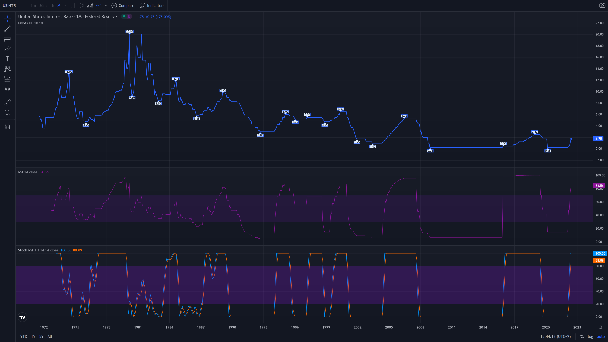

# [💹 Forex USD Currency Market Chart 💹](https://ayidouble.github.io/Forex-USD-Currency-Market-Chart)
💹 Forex charts with the USD price movements of the selected currencies 💹

**Link** : **[https://ayidouble.github.io/Forex-USD-Currency-Market-Chart](https://ayidouble.github.io/Forex-USD-Currency-Market-Chart)** 

# [💹 Federal Funds Rate (FEDERAL FUNDS CHART) 💹](https://ayidouble.github.io/Forex-USD-Currency-Market-Chart/USFEDFUNDSRATE)

# 💹 Currencies 💹

## [💹 USD/CHF (US-Dollar/Swiss franc) 💹](https://ayidouble.github.io/Forex-USD-Currency-Market-Chart/USDCHF)

## [💹 USD/EUR (US-Dollar/Euro) 💹](https://ayidouble.github.io/Forex-USD-Currency-Market-Chart/USDEUR)

## [💹 USD/GBP (US-Dollar/Pound sterling) 💹](https://ayidouble.github.io/Forex-USD-Currency-Market-Chart/USDGBP)

## [💹 USD/JPY (US-Dollar/Japanese yen) 💹](https://ayidouble.github.io/Forex-USD-Currency-Market-Chart/USDJPY)

## [💹 USD/CAD (US-Dollar/Canadian dollar) 💹](https://ayidouble.github.io/Forex-USD-Currency-Market-Chart/USDCAD)
